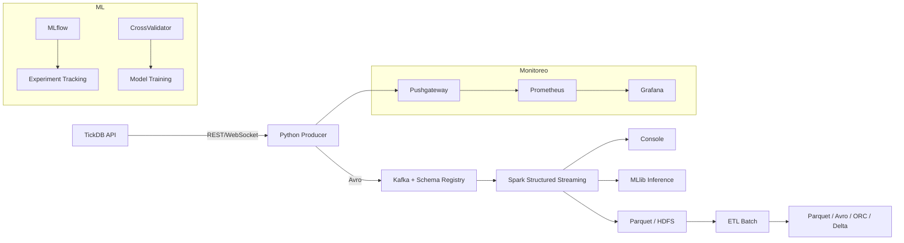

# Visión General de la Arquitectura

## Arquitectura Kappa

El proyecto sigue el patrón **Kappa Architecture**, donde todo el procesamiento se realiza sobre un flujo de datos en tiempo real, eliminando la necesidad de capas batch separadas. Esto permite unificar el procesamiento streaming y batch en un solo pipeline.

## Principios

1. **Tiempo real**: Los datos se procesan segundos después de generados
2. **Escalabilidad horizontal**: Cada componente puede escalarse independientemente
3. **Tolerancia a fallos**: Kafka persiste los eventos, Spark tiene checkpointing
4. **Reproducibilidad**: Los eventos pueden reprocesarse desde cualquier punto
5. **ML distribuido**: Entrenamiento y predicción distribuida con Spark MLlib

## Flujo

1. **Ingesta**: TickDB API → Producer Python (REST cada 30s o WebSocket continuo)
2. **Buffer**: Kafka con retención de 7 días, 3 particiones
3. **Procesamiento**: Spark Structured Streaming con ventanas de tiempo y watermarking
4. **Almacenamiento**: Parquet local + HDFS (múltiples formatos)
5. **ML**: Spark MLlib para entrenamiento distribuido, inferencia vía foreachBatch
6. **Monitoreo**: Prometheus + Grafana para métricas de todo el pipeline

## Supuestos Técnicos de Ejecución

1. **Docker Desktop** debe estar ejecutándose en el host
2. **Red Docker** `01-docker_default` debe estar activa y compartir nombres de servicios
3. **Memoria mínima**: 4GB RAM asignados a Docker
4. **Productor**: Debe ejecutarse antes que el consumidor Spark
5. **Orden de ejecución**: Kafka → Productor → Spark (Jupyter)
